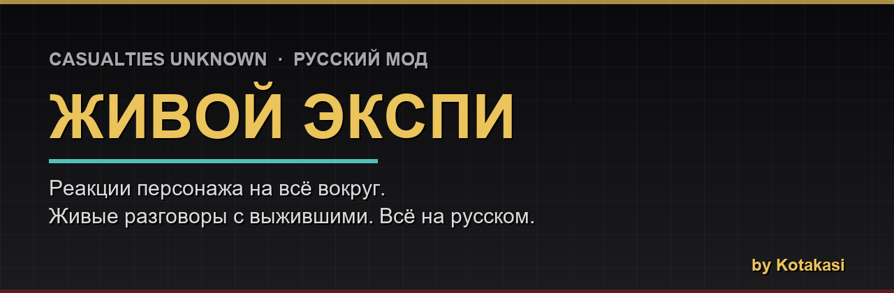

  

<h1 align="center">Живой Экспи — мод на диалоги и расширенные NPC</h1>

  <b>Casualties Unknown (Demo 7.0.1)</b> · полностью на русском · совместим с КООП 
  Экспи реагирует на всё, что с ним творится, а выжившие наконец-то стали живыми.

  

  
  
  
  

---

## Что это

Ванильный Экспи молчит почти обо всём. Этот мод его «включает»: он комментирует находки, ноет от боли и холода, радуется удаче — своими словами и по-разному, через те же облачка над головой, что и обычные реплики. А торговцы перестали быть ходячими лавками: теперь это живые выжившие, у каждого свой характер и своя история, которую можно вытащить разговором.

Родные файлы игры мод **не трогает**. Снёс папку — всё как было.

---

## Что теперь умеет Экспи

- **Комментирует каждый подобранный предмет** — своими словами, по-разному. И реплика зависит от настроения: в отчаянии и на кураже про один и тот же пистолет он скажет совсем разное.
- **Не спойлерит**: если интеллекта не хватает опознать вещь — не выдаёт, что это.
- **Реагирует на своё состояние** — боль, голод, холод, кровь, тошнота, усталость и ещё десяток. Тоже по-разному, смотря по настроению.
- **Замечает хорошее** — радость, фокус, крепкий иммунитет. Раньше на это он молчал.
- **Читает записки и PDA**, что валяются на слоях, и реагирует на них.

## Разговор с выжившими (новое)

Жми **ПКМ по выжившему** — появится выбор:

- **Торговать** — обычная панель обмена, как всегда.
- **Поговорить** — живой диалог через облачка.

В разговоре можно:

- **Расспросить, кто он** — и он начнёт рассказывать свою историю. По его словам ты задаёшь **встречные вопросы**, как в RPG: где твой напарник, почему не убиваешь, чего боишься. Чем больше он тебе доверяет — тем больше открывает. Трое выживших — три разных характера и три разных судьбы, все мрачные и в духе мира игры.
- **Дать предмет из руки на осмотр** — он расскажет, что это (чем выше доверие, тем больше вещей оглядит за беседу).
- **Попросить помощи** — если доверие высокое и он видит, что тебе совсем плохо (хлещет кровь, заражение, яд), он бросит тебе под ноги лечащее из своих запасов. Подбери с пола.

> Доверие выживших — не цифра с потолка, а родная репутация игры: она у каждого своя и растёт, если **обнять** его и **давать то, что ему нужно**. Тёплые ветки диалога открываются, когда он реально к тебе потеплеет.

---

## Установка (минута)

1. Открой папку с игрой — где лежит `CasualtiesUnknown.exe`.
   В Steam: ПКМ по игре → **Управление → Просмотреть локальные файлы**.
2. Скопируй **всё** из архива в папку с игрой. На вопрос «заменить/объединить?» — соглашайся, это безопасно.
3. Запускай игру. Готово.

Загрузчик **BepInEx уже внутри** архива — отдельно ставить ничего не нужно. Если у тебя уже стоят другие мои моды (русификатор, чит-меню) — папку `BepInEx` смело объединяй, ничего не сломается.

## Обновления — сами, изнутри игры

Мод проверяет обновление при запуске. Если вышла новая версия — в главном меню всплывёт окошко с описанием изменений и кнопкой **«Обновить»**. Нажал — скачалось, перезапустил игру — встало. Никаких ручных переустановок.

Не нравится? Выключается в конфиге:
`BepInEx\config\ru.kotakasi.casualtiesunknown.immersion.cfg` → `AutoUpdateCheck = false`.

---

## Совместимость

- Сделано под **Casualties Unknown Demo 7.0.1**.
- Дружит с **КООП** и с любыми модами, **которые не добавляют свои реакции Экспи** (на момент сборки — со всеми).
- Спокойно живёт рядом с моим русификатором и чит-меню.

## Если что-то пошло не так

- Мод не работает? Проверь, что в папке игры появились `winhttp.dll` и папка `BepInEx`. Антивирус иногда сносит `winhttp.dll` — добавь папку игры в исключения и распакуй заново.
- Поймал баг или есть идея — пиши, чиню.

---

Делал от души — Kotakasi. Развлекайся.

